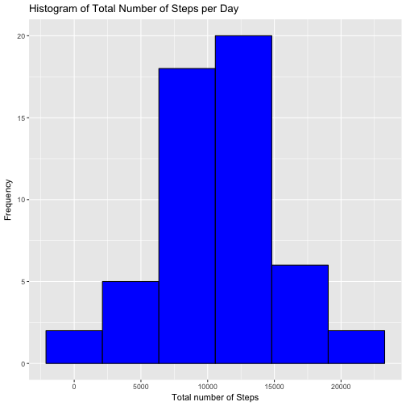
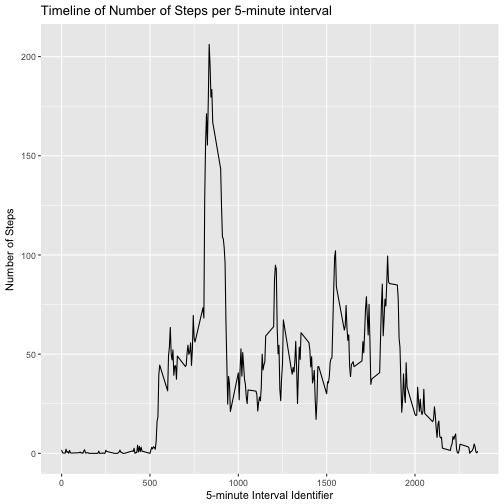
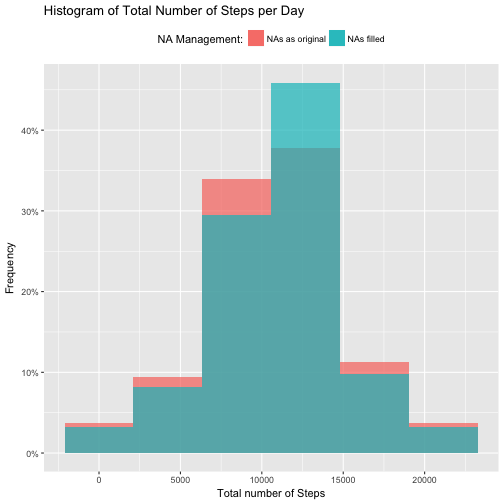
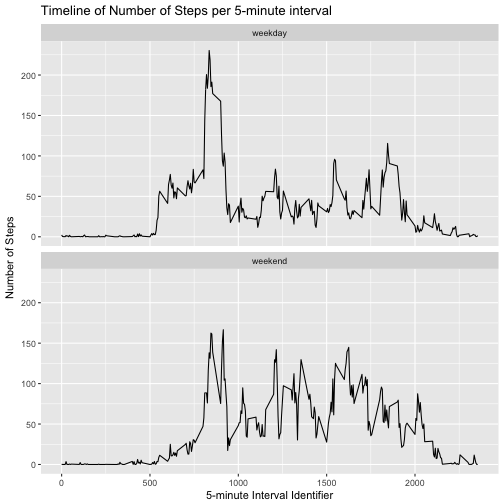

Reproducible Research - Peer Assessment 1
=========================================================================
### By Carlos Pedrotti

Markdown file created in order to complete *Project 1* of 
*Reproducible Research* course from *Coursera*

Assignments presented at README.md file in 
[My Forked Github Repo](https://github.com/carloshsp/RepData_PeerAssessment1)

<br>
<br>
<br>

## Load Required Libraries

In order to complete this assignment the following libraries 
are required (supressing messages and warnings to avoid too much noise):


```r
suppressMessages(suppressWarnings(require(data.table)))
suppressMessages(suppressWarnings(require(tidyverse)))
suppressMessages(suppressWarnings(require(lubridate)))
suppressMessages(suppressWarnings(require(scales)))
```

<br>
<br>
<br>

## Loading and preprocessing the data

1. assign url to a variable and create a temporary file
2. download zipped url to temp file
3. read using fread from data.table (works well with unzip) and assign the 
result to a variable called **act**
4. unlink temp file, remove unused variables from environment
5. transform variable *date* to class *Date* using lubridate's *ymd*


```r
url <- "https://github.com/carloshsp/RepData_PeerAssessment1/raw/master/activity.zip"
temp <- tempfile()
download.file(url, temp)
act <- fread(unzip(temp))
unlink(temp)
rm(temp, url)
act <- act %>% mutate(date = ymd(date))
```

<br>
<br>
<br>

## What is mean total number of steps taken per day?

First a new variable *acttable* is created by summarizing the sum of steps 
for each day to a variable called *stepsum*, using *dplyr* chain commands


```r
acttable <- act %>% group_by(date) %>% summarize(stepsum = sum(steps))
```
<br>

Then a histogram plot over *stepsum* is created using *ggplot2* 
(note that na.rm=T in order to eliminate missing data). 


```r
ggplot(acttable) + 
        geom_histogram(aes(stepsum), bins=6, na.rm = T, 
                       fill = "blue", color = "black") +
        ggtitle("Histogram of Total Number of Steps per Day") +
        xlab("Total number of Steps") +
        ylab("Frequency")
```


<br>

Mean and median are calculated using the following code:

```r
meansteps <- mean(acttable$stepsum, na.rm = T)
mediansteps <- median(acttable$stepsum, na.rm = T)
```

**The mean number of steps per day is 10766.19**.

**The median number of steps per day is 10765**

<br>
<br>
<br>

## What is the average daily activity pattern?

First a new variable *actint* is created by summarizing the sum of steps 
for each interval, using *dplyr* chain commands


```r
actint <- act %>% group_by(interval) %>% 
        summarize(stepmean = mean(steps, na.rm = TRUE))
```
<br>

Then a simple line graph is created using *ggplot2*


```r
ggplot(actint) +
        geom_line(aes(interval, stepmean)) +
        ggtitle("Timeline of Number of Steps per 5-minute interval") +
        ylab("Number of Steps") +
        xlab("5-minute Interval Identifier")
```


<br>

Calculation of the maximum number of steps per interval:


```r
maxsteps <- actint$interval[match(max(actint$stepmean), actint$stepmean)]
```

**The maximum number of average steps per interval is 206.17,** 
**which occurs at interval identifier no. 835.** 

<br>
<br>
<br>

## Imputing missing values

Calculating number of missing values:


```r
NASteps <- sum(is.na(act$steps))
```

**Total number of missing values: 2304**

<br>
<br>

In order to fill missing values a for loop is created to fill each missing 
value using the *actint* summary, matching it with the mean value for the same 
interval across all days. The result is assign to a new dataset called 
**actfill**. 


```r
actfill <- act
for(i in 1:length(actfill$steps)) {
        if(is.na(actfill$steps[i]) == TRUE) {
                actfill$steps[i] <- actint$stepmean[match(actfill$interval[i], 
                                                      actint$interval)]
        }
}
```

<br>
<br>

In order to construct a histogram and show the variation of data averages after
filling missing values with the above mentioned strategy, *ggplot2* was used
and alpha values for both the previous histogram and actual one appear in the
same plot, evidencing better the variation from before and after the filling.

Those are the steps:
1. summarize filled data to *actfilldata* using *dplyr* chain commands
2. add new variable *stepfill* to *acttable*
3. Create a histogram using both variables *stepsum* (summarized and created in 
the previous assignment, still with missing values not filled) and *stepfill*


```r
actfilltable <- actfill %>% group_by(date) %>% summarize(stepsum = sum(steps))
acttable$stepfill <- actfilltable$stepsum 
ggplot(acttable) + 
        geom_histogram(aes(stepsum, fill = "NAs as original", 
                           y = ..count../sum(..count..)), 
                       bins=6, na.rm = T, alpha = 0.7) +
        geom_histogram(aes(stepfill, fill = "NAs filled", 
                           y = ..count../sum(..count..)), 
                       bins=6, na.rm = T, alpha = 0.7) +
        ggtitle("Histogram of Total Number of Steps per Day") +
        xlab("Total number of Steps") +
        scale_y_continuous(name = "Frequency", label = percent) +
        theme(legend.position = "top") + 
        labs(fill = "NA Management:")
```


<br>

Calculate new means and medians

```r
meanfillsteps <- mean(actfilltable$stepsum, na.rm = T)
medianfillsteps <- median(actfilltable$stepsum, na.rm = T)
```

**After filling missing values, means and medians changed as following:**

**MEANS: from 10766.19 to 10766.19 -- No change**

**MEDIANS: from 10765 to 10766.19 -- raised to mean**

<br>
<br>
<br>

## Are there differences in activity patterns between weekdays and weekends?

Creating a new variable *wday* on *actfill* dataset:
1. using *lubridate* package, function *wday* transform dates to weekdays 
represented by integers 1 to 7 (sunday to saturday)
2. for loop created to apply ifelse function to insert "weekday" if wday is in 
vector *c(2:6)*, or else inserting "weekend".
3. variable *wday* class is converted to factor


```r
actfill$wday <- wday(actfill$date)
for(i in 1:length(actfill$date)) {
        actfill$wday[i] <- ifelse(actfill$wday[i] %in% c(2:6), 
                                  "weekday", "weekend")
}
actfill$wday <- as.factor(actfill$wday)
```
<br>

Plotting timeline from averaged intervals between weekdays and weekends

1. Summarize *actfill* using *group_by(wday, interval)* in order to sum steps
averaged by weekday and interval.
2. Plot ggplot graph faceted by *wday*


```r
actwday <- actfill %>% group_by(wday, interval) %>% 
        summarize(stepmean = mean(steps))
ggplot(actwday) +
        facet_wrap(~wday, 2) +
        geom_line(aes(interval, stepmean)) +
        ggtitle("Timeline of Number of Steps per 5-minute interval") +
        ylab("Number of Steps") +
        xlab("5-minute Interval Identifier")
```


